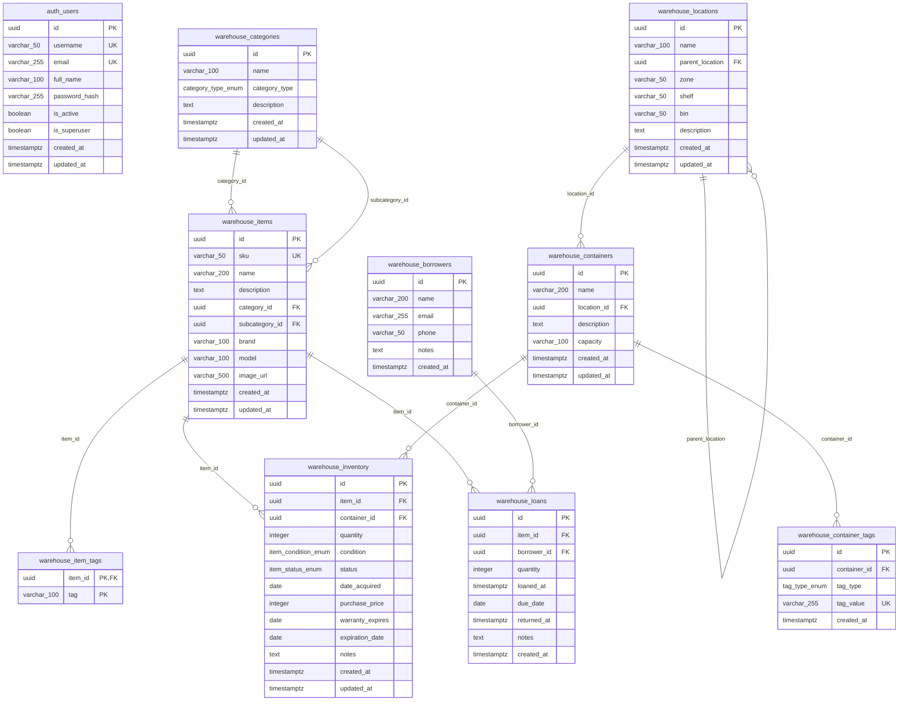

# Database Schema Documentation

This document describes the database schema for the Home Warehouse System.

## Schemas

The database uses two schemas:

- **`auth`** - Authentication and user management
- **`warehouse`** - Core warehouse functionality

## Database Tables

### Auth Schema

#### `auth.users`
Stores user authentication information.

| Column | Type | Description |
|--------|------|-------------|
| `id` | UUID | Primary key (uuidv7) |
| `username` | VARCHAR(50) | Unique username |
| `email` | VARCHAR(255) | Unique email address |
| `full_name` | VARCHAR(100) | User's full name |
| `password_hash` | VARCHAR(255) | Hashed password |
| `is_active` | BOOLEAN | Account active status (default: true) |
| `is_superuser` | BOOLEAN | Superuser flag (default: false) |
| `created_at` | TIMESTAMPTZ | Creation timestamp |
| `updated_at` | TIMESTAMPTZ | Last update timestamp |

### Warehouse Schema

#### `warehouse.categories`
Item categories for organizing inventory (main categories and subcategories).

| Column | Type | Description |
|--------|------|-------------|
| `id` | UUID | Primary key (uuidv7) |
| `name` | VARCHAR(100) | Category name |
| `category_type` | category_type_enum | Category type: MAIN or SUB |
| `description` | TEXT | Category description |
| `created_at` | TIMESTAMPTZ | Creation timestamp |
| `updated_at` | TIMESTAMPTZ | Last update timestamp |

**Indexes:**
- `ix_categories_name` on `name`

#### `warehouse.locations`
Hierarchical storage locations (e.g., rooms, zones, shelves, bins).

| Column | Type | Description |
|--------|------|-------------|
| `id` | UUID | Primary key (uuidv7) |
| `name` | VARCHAR(100) | Location name |
| `parent_location` | UUID | Reference to parent location (self-referencing) |
| `zone` | VARCHAR(50) | Zone identifier |
| `shelf` | VARCHAR(50) | Shelf identifier |
| `bin` | VARCHAR(50) | Bin identifier |
| `description` | TEXT | Location description |
| `created_at` | TIMESTAMPTZ | Creation timestamp |
| `updated_at` | TIMESTAMPTZ | Last update timestamp |

**Indexes:**
- `ix_locations_name` on `name`
- `ix_locations_parent_location` on `parent_location`

#### `warehouse.containers`
Storage containers within locations (e.g., boxes, bins, drawers).

| Column | Type | Description |
|--------|------|-------------|
| `id` | UUID | Primary key (uuidv7) |
| `name` | VARCHAR(200) | Container name |
| `location_id` | UUID | Reference to `warehouse.locations` (CASCADE delete) |
| `description` | TEXT | Container description |
| `capacity` | VARCHAR(100) | Container capacity |
| `created_at` | TIMESTAMPTZ | Creation timestamp |
| `updated_at` | TIMESTAMPTZ | Last update timestamp |

**Indexes:**
- `ix_containers_name` on `name`
- `ix_containers_location_id` on `location_id`

#### `warehouse.items`
Item catalog/master data for all items in the system.

| Column | Type | Description |
|--------|------|-------------|
| `id` | UUID | Primary key (uuidv7) |
| `sku` | VARCHAR(50) | Unique SKU |
| `name` | VARCHAR(200) | Item name |
| `description` | TEXT | Item description |
| `category_id` | UUID | Reference to `warehouse.categories` (main category) |
| `subcategory_id` | UUID | Reference to `warehouse.categories` (subcategory, optional) |
| `brand` | VARCHAR(100) | Brand name |
| `model` | VARCHAR(100) | Model number |
| `image_url` | VARCHAR(500) | Image URL |
| `created_at` | TIMESTAMPTZ | Creation timestamp |
| `updated_at` | TIMESTAMPTZ | Last update timestamp |

**Indexes:**
- `ix_items_name` on `name`
- `ix_items_category_id` on `category_id`
- `ix_items_subcategory_id` on `subcategory_id`

#### `warehouse.item_tags`
Tags associated with items (many-to-many relationship).

| Column | Type | Description |
|--------|------|-------------|
| `item_id` | UUID | Reference to `warehouse.items` (CASCADE delete) |
| `tag` | VARCHAR(100) | Tag value |
| PRIMARY KEY | (`item_id`, `tag`) | Composite primary key |

**Indexes:**
- `ix_item_tags_tag` on `tag`

#### `warehouse.inventory`
Physical instances of items stored in containers.

| Column | Type | Description |
|--------|------|-------------|
| `id` | UUID | Primary key (uuidv7) |
| `item_id` | UUID | Reference to `warehouse.items` (CASCADE delete) |
| `container_id` | UUID | Reference to `warehouse.containers` (CASCADE delete) |
| `quantity` | INTEGER | Quantity (>= 0, default: 1) |
| `condition` | item_condition_enum | Item condition (see ENUMs below) |
| `status` | item_status_enum | Item status (see ENUMs below) |
| `date_acquired` | DATE | Acquisition date |
| `purchase_price` | INTEGER | Purchase price in cents |
| `warranty_expires` | DATE | Warranty expiration date |
| `expiration_date` | DATE | Item expiration date |
| `notes` | TEXT | Additional notes |
| `created_at` | TIMESTAMPTZ | Creation timestamp |
| `updated_at` | TIMESTAMPTZ | Last update timestamp |

**Indexes:**
- `ix_inventory_item_id` on `item_id`
- `ix_inventory_container_id` on `container_id`

#### `warehouse.container_tags`
RFID, NFC, or QR tags associated with containers.

| Column | Type | Description |
|--------|------|-------------|
| `id` | UUID | Primary key (uuidv7) |
| `container_id` | UUID | Reference to `warehouse.containers` (CASCADE delete) |
| `tag_type` | tag_type_enum | Tag type (see ENUMs below) |
| `tag_value` | VARCHAR(255) | Unique tag value |
| `created_at` | TIMESTAMPTZ | Creation timestamp |

**Indexes:**
- `ix_container_tags_container_id` on `container_id`

#### `warehouse.borrowers`
People who borrow items from the warehouse.

| Column | Type | Description |
|--------|------|-------------|
| `id` | UUID | Primary key (uuidv7) |
| `name` | VARCHAR(200) | Borrower name |
| `email` | VARCHAR(255) | Email address |
| `phone` | VARCHAR(50) | Phone number |
| `notes` | TEXT | Additional notes |
| `created_at` | TIMESTAMPTZ | Creation timestamp |

#### `warehouse.loans`
Tracks items loaned to borrowers.

| Column | Type | Description |
|--------|------|-------------|
| `id` | UUID | Primary key (uuidv7) |
| `item_id` | UUID | Reference to `warehouse.items` |
| `borrower_id` | UUID | Reference to `warehouse.borrowers` |
| `quantity` | INTEGER | Quantity loaned (default: 1) |
| `loaned_at` | TIMESTAMPTZ | Loan timestamp (default: now) |
| `due_date` | DATE | Expected return date |
| `returned_at` | TIMESTAMPTZ | Actual return timestamp (NULL if not returned) |
| `notes` | TEXT | Additional notes |
| `created_at` | TIMESTAMPTZ | Creation timestamp |

**Indexes:**
- `ix_loans_item_id` on `item_id`
- `ix_loans_borrower_id` on `borrower_id`

## ENUM Types

### `warehouse.item_condition_enum`
Item condition values:
- `NEW`
- `EXCELLENT`
- `GOOD`
- `FAIR`
- `POOR`
- `DAMAGED`
- `FOR_REPAIR`

### `warehouse.item_status_enum`
Item status values:
- `AVAILABLE`
- `IN_USE`
- `RESERVED`
- `ON_LOAN`
- `IN_TRANSIT`
- `DISPOSED`
- `MISSING`

### `warehouse.tag_type_enum`
Container tag types:
- `RFID`
- `NFC`
- `QR`

### `warehouse.category_type_enum`
Category type values:
- `MAIN`
- `SUB`

## Entity Relationship Diagram

## Relationships Summary

1. **Locations** → **Locations** (self-referencing): Hierarchical location structure
2. **Locations** → **Containers**: Containers belong to locations
3. **Categories** → **Items** (category_id): Items belong to main categories
4. **Categories** → **Items** (subcategory_id): Items can optionally belong to subcategories
5. **Items** → **Item Tags**: Many-to-many tags on items
6. **Items** → **Inventory**: Inventory entries reference items
7. **Containers** → **Inventory**: Inventory entries reference containers
8. **Containers** → **Container Tags**: Containers can have RFID/NFC/QR tags
9. **Items** → **Loans**: Loans reference items
10. **Borrowers** → **Loans**: Loans reference borrowers
