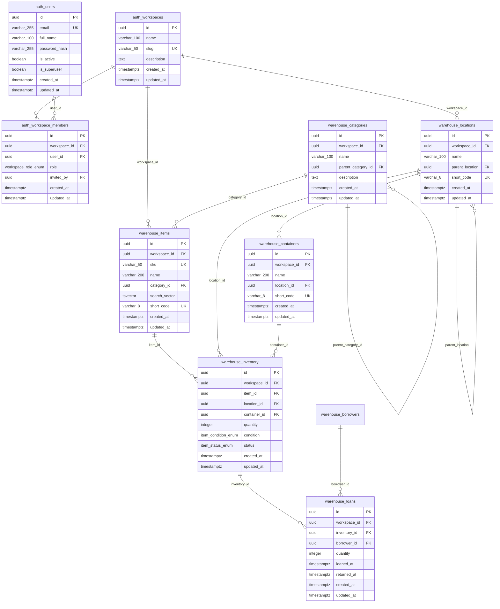

# Database Schema Documentation

This document describes the database schema for the Home Warehouse System.

## Schemas

The database uses two schemas:

- **`auth`** - Authentication and user management
- **`warehouse`** - Core warehouse functionality

## Database Tables

### Auth Schema

#### `auth.users`
Stores user authentication information.

| Column | Type | Description |
|--------|------|-------------|
| `id` | UUID | Primary key (uuidv7) |
| `email` | VARCHAR(255) | Unique email address |
| `full_name` | VARCHAR(100) | User's full name (required) |
| `password_hash` | VARCHAR(255) | Hashed password |
| `is_active` | BOOLEAN | Account active status (default: true) |
| `is_superuser` | BOOLEAN | Superuser flag (default: false) |
| `created_at` | TIMESTAMPTZ | Creation timestamp |
| `updated_at` | TIMESTAMPTZ | Last update timestamp |

#### `auth.workspaces`
Isolated environments for organizing inventory. Each workspace has its own data.

| Column | Type | Description |
|--------|------|-------------|
| `id` | UUID | Primary key (uuidv7) |
| `name` | VARCHAR(100) | Workspace display name |
| `slug` | VARCHAR(50) | URL-friendly identifier (unique) |
| `description` | TEXT | Workspace description |
| `created_at` | TIMESTAMPTZ | Creation timestamp |
| `updated_at` | TIMESTAMPTZ | Last update timestamp |

**Indexes:**
- `ix_workspaces_slug` on `slug`

#### `auth.workspace_members`
Links users to workspaces with role-based access control.

| Column | Type | Description |
|--------|------|-------------|
| `id` | UUID | Primary key (uuidv7) |
| `workspace_id` | UUID | Reference to `auth.workspaces` (CASCADE delete) |
| `user_id` | UUID | Reference to `auth.users` (CASCADE delete) |
| `role` | workspace_role_enum | User's role in workspace |
| `invited_by` | UUID | Reference to `auth.users` who invited (SET NULL on delete) |
| `created_at` | TIMESTAMPTZ | Creation timestamp |
| `updated_at` | TIMESTAMPTZ | Last update timestamp |

**Indexes:**
- `ix_workspace_members_user` on `user_id`
- `ix_workspace_members_workspace` on `workspace_id`
- Unique constraint on `(workspace_id, user_id)`

### Warehouse Schema

> **Note:** All warehouse tables include a `workspace_id` column for multi-tenant isolation.
> Each record belongs to exactly one workspace.

#### `warehouse.categories`
Hierarchical item categories for organizing inventory.

| Column | Type | Description |
|--------|------|-------------|
| `id` | UUID | Primary key (uuidv7) |
| `name` | VARCHAR(100) | Category name |
| `parent_category_id` | UUID | Reference to parent category (self-referencing, NULL for root) |
| `description` | TEXT | Category description |
| `created_at` | TIMESTAMPTZ | Creation timestamp |
| `updated_at` | TIMESTAMPTZ | Last update timestamp |

**Indexes:**
- `ix_categories_name` on `name`
- `ix_categories_parent` on `parent_category_id`

#### `warehouse.locations`
Hierarchical storage locations (e.g., rooms, zones, shelves, bins).

| Column | Type | Description |
|--------|------|-------------|
| `id` | UUID | Primary key (uuidv7) |
| `name` | VARCHAR(100) | Location name |
| `parent_location` | UUID | Reference to parent location (self-referencing) |
| `zone` | VARCHAR(50) | Zone identifier |
| `shelf` | VARCHAR(50) | Shelf identifier |
| `bin` | VARCHAR(50) | Bin identifier |
| `description` | TEXT | Location description |
| `short_code` | VARCHAR(8) | Unique code for QR labels (e.g., `C5X1D3`) |
| `created_at` | TIMESTAMPTZ | Creation timestamp |
| `updated_at` | TIMESTAMPTZ | Last update timestamp |

**Indexes:**
- `ix_locations_name` on `name`
- `ix_locations_parent_location` on `parent_location`
- `ix_locations_short_code` on `short_code`

#### `warehouse.containers`
Storage containers within locations (e.g., boxes, bins, drawers).

| Column | Type | Description |
|--------|------|-------------|
| `id` | UUID | Primary key (uuidv7) |
| `name` | VARCHAR(200) | Container name |
| `location_id` | UUID | Reference to `warehouse.locations` (CASCADE delete) |
| `description` | TEXT | Container description |
| `capacity` | VARCHAR(100) | Container capacity |
| `short_code` | VARCHAR(8) | Unique code for QR labels (e.g., `A7X3B2`) |
| `created_at` | TIMESTAMPTZ | Creation timestamp |
| `updated_at` | TIMESTAMPTZ | Last update timestamp |

**Indexes:**
- `ix_containers_name` on `name`
- `ix_containers_location_id` on `location_id`
- `ix_containers_short_code` on `short_code`

#### `warehouse.items`
Item catalog/master data for all items in the system.

| Column | Type | Description |
|--------|------|-------------|
| `id` | UUID | Primary key (uuidv7) |
| `sku` | VARCHAR(50) | Unique SKU |
| `name` | VARCHAR(200) | Item name |
| `description` | TEXT | Item description |
| `category_id` | UUID | Reference to `warehouse.categories` |
| `brand` | VARCHAR(100) | Brand name |
| `model` | VARCHAR(100) | Model number |
| `image_url` | VARCHAR(500) | Image URL |
| `serial_number` | VARCHAR(100) | Serial number |
| `manufacturer` | VARCHAR(100) | Manufacturer name |
| `is_insured` | BOOLEAN | Whether item is insured (default: false) |
| `is_archived` | BOOLEAN | Soft delete flag (default: false) |
| `lifetime_warranty` | BOOLEAN | Has lifetime warranty (default: false) |
| `warranty_details` | TEXT | Warranty information |
| `purchased_from` | UUID | Reference to `warehouse.companies` |
| `search_vector` | TSVECTOR | Generated full-text search column |
| `short_code` | VARCHAR(8) | Unique code for QR labels (e.g., `B3X2A7`) |
| `created_at` | TIMESTAMPTZ | Creation timestamp |
| `updated_at` | TIMESTAMPTZ | Last update timestamp |

**Indexes:**
- `ix_items_name` on `name`
- `ix_items_category_id` on `category_id`
- `ix_items_search` on `search_vector` (GIN index for full-text search)
- `ix_items_short_code` on `short_code`

#### `warehouse.item_labels`
Labels associated with items (many-to-many relationship via labels table).

| Column | Type | Description |
|--------|------|-------------|
| `item_id` | UUID | Reference to `warehouse.items` (CASCADE delete) |
| `label_id` | UUID | Reference to `warehouse.labels` (CASCADE delete) |
| PRIMARY KEY | (`item_id`, `label_id`) | Composite primary key |

#### `warehouse.labels`
Structured labels with colors for categorizing items.

| Column | Type | Description |
|--------|------|-------------|
| `id` | UUID | Primary key (uuidv7) |
| `name` | VARCHAR(100) | Unique label name |
| `color` | VARCHAR(7) | Hex color code (e.g., #FF5733) |
| `description` | TEXT | Label description |
| `created_at` | TIMESTAMPTZ | Creation timestamp |
| `updated_at` | TIMESTAMPTZ | Last update timestamp |

#### `warehouse.inventory`
Physical instances of items stored at locations or in containers.

| Column | Type | Description |
|--------|------|-------------|
| `id` | UUID | Primary key (uuidv7) |
| `item_id` | UUID | Reference to `warehouse.items` (CASCADE delete) |
| `location_id` | UUID | Reference to `warehouse.locations` (CASCADE delete) |
| `container_id` | UUID | Reference to `warehouse.containers` (optional, SET NULL on delete) |
| `quantity` | INTEGER | Quantity (>= 0, default: 1) |
| `condition` | item_condition_enum | Item condition (see ENUMs below) |
| `status` | item_status_enum | Item status (see ENUMs below) |
| `date_acquired` | DATE | Acquisition date |
| `purchase_price` | INTEGER | Purchase price in cents |
| `currency_code` | VARCHAR(3) | ISO 4217 currency code (default: EUR) |
| `warranty_expires` | DATE | Warranty expiration date |
| `expiration_date` | DATE | Item expiration date |
| `notes` | TEXT | Additional notes |
| `created_at` | TIMESTAMPTZ | Creation timestamp |
| `updated_at` | TIMESTAMPTZ | Last update timestamp |

**Indexes:**
- `ix_inventory_item_id` on `item_id`
- `ix_inventory_location_id` on `location_id`
- `ix_inventory_container_id` on `container_id`

#### `warehouse.container_tags`
RFID, NFC, or QR tags associated with containers.

| Column | Type | Description |
|--------|------|-------------|
| `id` | UUID | Primary key (uuidv7) |
| `container_id` | UUID | Reference to `warehouse.containers` (CASCADE delete) |
| `tag_type` | tag_type_enum | Tag type (see ENUMs below) |
| `tag_value` | VARCHAR(255) | Unique tag value |
| `created_at` | TIMESTAMPTZ | Creation timestamp |
| `updated_at` | TIMESTAMPTZ | Last update timestamp |

**Indexes:**
- `ix_container_tags_container_id` on `container_id`

#### `warehouse.borrowers`
People who borrow items from the warehouse.

| Column | Type | Description |
|--------|------|-------------|
| `id` | UUID | Primary key (uuidv7) |
| `name` | VARCHAR(200) | Borrower name |
| `email` | VARCHAR(255) | Email address |
| `phone` | VARCHAR(50) | Phone number |
| `notes` | TEXT | Additional notes |
| `created_at` | TIMESTAMPTZ | Creation timestamp |
| `updated_at` | TIMESTAMPTZ | Last update timestamp |

#### `warehouse.loans`
Tracks inventory items loaned to borrowers.

| Column | Type | Description |
|--------|------|-------------|
| `id` | UUID | Primary key (uuidv7) |
| `inventory_id` | UUID | Reference to `warehouse.inventory` |
| `borrower_id` | UUID | Reference to `warehouse.borrowers` |
| `quantity` | INTEGER | Quantity loaned (default: 1) |
| `loaned_at` | TIMESTAMPTZ | Loan timestamp (default: now) |
| `due_date` | DATE | Expected return date |
| `returned_at` | TIMESTAMPTZ | Actual return timestamp (NULL if not returned) |
| `notes` | TEXT | Additional notes |
| `created_at` | TIMESTAMPTZ | Creation timestamp |
| `updated_at` | TIMESTAMPTZ | Last update timestamp |

**Indexes:**
- `ix_loans_inventory_id` on `inventory_id`
- `ix_loans_borrower_id` on `borrower_id`
- `ix_loans_active_inventory` unique partial index on `inventory_id` WHERE `returned_at IS NULL`

#### `warehouse.inventory_movements`
Tracks movement history of inventory between locations/containers.

| Column | Type | Description |
|--------|------|-------------|
| `id` | UUID | Primary key (uuidv7) |
| `inventory_id` | UUID | Reference to `warehouse.inventory` (CASCADE delete) |
| `from_location_id` | UUID | Previous location (SET NULL on delete) |
| `from_container_id` | UUID | Previous container (SET NULL on delete) |
| `to_location_id` | UUID | New location (SET NULL on delete) |
| `to_container_id` | UUID | New container (SET NULL on delete) |
| `quantity` | INTEGER | Quantity moved (default: 1) |
| `moved_by` | UUID | Reference to `auth.users` (SET NULL on delete) |
| `reason` | TEXT | Reason for movement |
| `created_at` | TIMESTAMPTZ | Movement timestamp |

**Indexes:**
- `ix_inventory_movements_inventory` on `inventory_id`
- `ix_inventory_movements_date` on `created_at`

## ENUM Types

### `auth.workspace_role_enum`
Workspace membership roles:
- `owner` - Full control, can delete workspace and manage members
- `admin` - Can manage all data, cannot delete workspace or remove owner
- `member` - Can CRUD inventory data
- `viewer` - Read-only access

### `warehouse.item_condition_enum`
Item condition values:
- `NEW`
- `EXCELLENT`
- `GOOD`
- `FAIR`
- `POOR`
- `DAMAGED`
- `FOR_REPAIR`

### `warehouse.item_status_enum`
Item status values:
- `AVAILABLE`
- `IN_USE`
- `RESERVED`
- `ON_LOAN`
- `IN_TRANSIT`
- `DISPOSED`
- `MISSING`

### `warehouse.tag_type_enum`
Container tag types:
- `RFID`
- `NFC`
- `QR`

### `warehouse.attachment_type_enum`
Attachment type values:
- `PHOTO`
- `MANUAL`
- `RECEIPT`
- `WARRANTY`
- `OTHER`

## Entity Relationship Diagram

## Relationships Summary

1. **Workspaces** → **Workspace Members**: Users belong to workspaces with roles
2. **Users** → **Workspace Members**: Users can belong to multiple workspaces
3. **Workspaces** → **All warehouse tables**: Complete data isolation per workspace
4. **Categories** → **Categories** (self-referencing): Hierarchical category structure
5. **Locations** → **Locations** (self-referencing): Hierarchical location structure
6. **Locations** → **Containers**: Containers belong to locations
7. **Categories** → **Items**: Items belong to categories (any level)
8. **Items** ↔ **Labels**: Many-to-many via `item_labels` junction table
9. **Items** → **Inventory**: Inventory entries reference items
10. **Locations** → **Inventory**: Inventory entries reference locations
11. **Containers** → **Inventory**: Inventory entries can optionally be in containers
12. **Containers** → **Container Tags**: Containers can have RFID/NFC/QR tags
13. **Inventory** → **Loans**: Loans reference specific inventory entries
14. **Borrowers** → **Loans**: Loans reference borrowers
15. **Inventory** → **Inventory Movements**: Movement history for inventory
16. **Users** → **Inventory Movements**: Track who moved items
