# Database Schema Documentation

This document describes the database schema for the Home Warehouse System.

## Schemas

The database uses two schemas:

- **`auth`** - Authentication and user management
- **`warehouse`** - Core warehouse functionality

## Database Tables

### Auth Schema

#### `auth.users`
Stores user authentication information.

| Column | Type | Description |
|--------|------|-------------|
| `id` | UUID | Primary key (uuidv7) |
| `email` | VARCHAR(255) | Unique email address |
| `full_name` | VARCHAR(100) | User's full name (required) |
| `password_hash` | VARCHAR(255) | Hashed password |
| `is_active` | BOOLEAN | Account active status (default: true) |
| `is_superuser` | BOOLEAN | Superuser flag (default: false) |
| `created_at` | TIMESTAMPTZ | Creation timestamp |
| `updated_at` | TIMESTAMPTZ | Last update timestamp |

#### `auth.workspaces`
Isolated environments for organizing inventory. Each workspace has its own data.

| Column | Type | Description |
|--------|------|-------------|
| `id` | UUID | Primary key (uuidv7) |
| `name` | VARCHAR(100) | Workspace display name |
| `slug` | VARCHAR(50) | URL-friendly identifier (unique) |
| `description` | TEXT | Workspace description |
| `created_at` | TIMESTAMPTZ | Creation timestamp |
| `updated_at` | TIMESTAMPTZ | Last update timestamp |

**Indexes:**
- `ix_workspaces_slug` on `slug`

#### `auth.workspace_members`
Links users to workspaces with role-based access control.

| Column | Type | Description |
|--------|------|-------------|
| `id` | UUID | Primary key (uuidv7) |
| `workspace_id` | UUID | Reference to `auth.workspaces` (CASCADE delete) |
| `user_id` | UUID | Reference to `auth.users` (CASCADE delete) |
| `role` | workspace_role_enum | User's role in workspace |
| `invited_by` | UUID | Reference to `auth.users` who invited (SET NULL on delete) |
| `created_at` | TIMESTAMPTZ | Creation timestamp |
| `updated_at` | TIMESTAMPTZ | Last update timestamp |

**Indexes:**
- `ix_workspace_members_user` on `user_id`
- `ix_workspace_members_workspace` on `workspace_id`
- Unique constraint on `(workspace_id, user_id)`

#### `auth.user_oauth_accounts`
External OAuth provider accounts linked to local users for SSO.

| Column | Type | Description |
|--------|------|-------------|
| `id` | UUID | Primary key (uuidv7) |
| `user_id` | UUID | Reference to `auth.users` (CASCADE delete) |
| `provider` | VARCHAR(20) | OAuth provider name (e.g., google, github) |
| `provider_user_id` | VARCHAR(255) | User ID from the OAuth provider |
| `email` | VARCHAR(255) | Email from OAuth provider |
| `display_name` | VARCHAR(100) | Display name from OAuth provider |
| `avatar_url` | VARCHAR(500) | Avatar URL from OAuth provider |
| `access_token` | TEXT | OAuth access token (encrypted at application layer) |
| `refresh_token` | TEXT | OAuth refresh token |
| `token_expires_at` | TIMESTAMPTZ | Token expiration time |
| `created_at` | TIMESTAMPTZ | Creation timestamp |
| `updated_at` | TIMESTAMPTZ | Last update timestamp |

**Indexes:**
- `ix_oauth_accounts_user` on `user_id`
- `ix_oauth_accounts_provider` on `(provider, provider_user_id)`
- Unique constraint on `(provider, provider_user_id)`

#### `auth.workspace_exports`
Audit log of workspace data exports for backup or migration.

| Column | Type | Description |
|--------|------|-------------|
| `id` | UUID | Primary key (uuidv7) |
| `workspace_id` | UUID | Reference to `auth.workspaces` (CASCADE delete) |
| `exported_by` | UUID | Reference to `auth.users` (SET NULL on delete) |
| `format` | VARCHAR(10) | Export format (e.g., xlsx, json) |
| `file_size_bytes` | BIGINT | Size of exported file |
| `record_counts` | JSONB | Snapshot of records exported per table |
| `created_at` | TIMESTAMPTZ | Creation timestamp |

**Indexes:**
- `ix_workspace_exports_workspace` on `workspace_id`
- `ix_workspace_exports_user` on `exported_by`

#### `auth.notifications`
User notifications for various events in the system.

| Column | Type | Description |
|--------|------|-------------|
| `id` | UUID | Primary key (uuidv7) |
| `user_id` | UUID | Reference to `auth.users` (CASCADE delete) |
| `workspace_id` | UUID | Reference to `auth.workspaces` (CASCADE delete, optional) |
| `notification_type` | notification_type_enum | Type of notification |
| `title` | VARCHAR(200) | Notification title |
| `message` | TEXT | Notification message |
| `is_read` | BOOLEAN | Read status (default: false) |
| `read_at` | TIMESTAMPTZ | When notification was read |
| `metadata` | JSONB | Additional data (entity IDs, links, etc.) |
| `created_at` | TIMESTAMPTZ | Creation timestamp |

**Indexes:**
- `ix_notifications_user` on `user_id`
- `ix_notifications_user_unread` on `user_id` WHERE `is_read = false`
- `ix_notifications_workspace` on `workspace_id`
- `ix_notifications_created` on `created_at DESC`

### Warehouse Schema

> **Note:** All warehouse tables include a `workspace_id` column for multi-tenant isolation.
> Each record belongs to exactly one workspace.

#### `warehouse.categories`
Hierarchical item categories for organizing inventory.

| Column | Type | Description |
|--------|------|-------------|
| `id` | UUID | Primary key (uuidv7) |
| `workspace_id` | UUID | Reference to `auth.workspaces` (CASCADE delete) |
| `name` | VARCHAR(100) | Category name |
| `parent_category_id` | UUID | Reference to parent category (self-referencing, NULL for root) |
| `description` | TEXT | Category description |
| `created_at` | TIMESTAMPTZ | Creation timestamp |
| `updated_at` | TIMESTAMPTZ | Last update timestamp |

**Indexes:**
- `ix_categories_workspace` on `workspace_id`
- `ix_categories_name` on `name`
- `ix_categories_parent` on `parent_category_id`

#### `warehouse.locations`
Hierarchical storage locations (e.g., rooms, zones, shelves, bins).

| Column | Type | Description |
|--------|------|-------------|
| `id` | UUID | Primary key (uuidv7) |
| `workspace_id` | UUID | Reference to `auth.workspaces` (CASCADE delete) |
| `name` | VARCHAR(100) | Location name |
| `parent_location` | UUID | Reference to parent location (self-referencing) |
| `zone` | VARCHAR(50) | Zone identifier |
| `shelf` | VARCHAR(50) | Shelf identifier |
| `bin` | VARCHAR(50) | Bin identifier |
| `description` | TEXT | Location description |
| `short_code` | VARCHAR(8) | Unique code for QR labels (e.g., `C5X1D3`) |
| `created_at` | TIMESTAMPTZ | Creation timestamp |
| `updated_at` | TIMESTAMPTZ | Last update timestamp |

**Indexes:**
- `ix_locations_workspace` on `workspace_id`
- `ix_locations_name` on `name`
- `ix_locations_parent_location` on `parent_location`
- `ix_locations_short_code` on `short_code`

#### `warehouse.containers`
Storage containers within locations (e.g., boxes, bins, drawers).

| Column | Type | Description |
|--------|------|-------------|
| `id` | UUID | Primary key (uuidv7) |
| `workspace_id` | UUID | Reference to `auth.workspaces` (CASCADE delete) |
| `name` | VARCHAR(200) | Container name |
| `location_id` | UUID | Reference to `warehouse.locations` (CASCADE delete) |
| `description` | TEXT | Container description |
| `capacity` | VARCHAR(100) | Container capacity |
| `short_code` | VARCHAR(8) | Unique code for QR labels (e.g., `A7X3B2`) |
| `created_at` | TIMESTAMPTZ | Creation timestamp |
| `updated_at` | TIMESTAMPTZ | Last update timestamp |

**Indexes:**
- `ix_containers_workspace` on `workspace_id`
- `ix_containers_name` on `name`
- `ix_containers_location_id` on `location_id`
- `ix_containers_short_code` on `short_code`

#### `warehouse.companies`
Vendors, stores, or manufacturers for tracking where items were purchased.

| Column | Type | Description |
|--------|------|-------------|
| `id` | UUID | Primary key (uuidv7) |
| `workspace_id` | UUID | Reference to `auth.workspaces` (CASCADE delete) |
| `name` | VARCHAR(200) | Company name |
| `website` | VARCHAR(500) | Company website URL |
| `notes` | TEXT | Additional notes |
| `created_at` | TIMESTAMPTZ | Creation timestamp |
| `updated_at` | TIMESTAMPTZ | Last update timestamp |

**Indexes:**
- `ix_companies_workspace` on `workspace_id`
- `ix_companies_name` on `name`
- Unique constraint on `(workspace_id, name)`

#### `warehouse.labels`
Structured labels with colors for categorizing items.

| Column | Type | Description |
|--------|------|-------------|
| `id` | UUID | Primary key (uuidv7) |
| `workspace_id` | UUID | Reference to `auth.workspaces` (CASCADE delete) |
| `name` | VARCHAR(100) | Label name |
| `color` | VARCHAR(7) | Hex color code (e.g., #FF5733) |
| `description` | TEXT | Label description |
| `created_at` | TIMESTAMPTZ | Creation timestamp |
| `updated_at` | TIMESTAMPTZ | Last update timestamp |

**Indexes:**
- `ix_labels_workspace` on `workspace_id`
- Unique constraint on `(workspace_id, name)`

#### `warehouse.items`
Item catalog/master data for all items in the system.

| Column | Type | Description |
|--------|------|-------------|
| `id` | UUID | Primary key (uuidv7) |
| `workspace_id` | UUID | Reference to `auth.workspaces` (CASCADE delete) |
| `sku` | VARCHAR(50) | SKU (unique per workspace) |
| `name` | VARCHAR(200) | Item name |
| `description` | TEXT | Item description |
| `category_id` | UUID | Reference to `warehouse.categories` (SET NULL on delete) |
| `brand` | VARCHAR(100) | Brand name |
| `model` | VARCHAR(100) | Model number |
| `image_url` | VARCHAR(500) | Image URL |
| `serial_number` | VARCHAR(100) | Serial number |
| `manufacturer` | VARCHAR(100) | Manufacturer name |
| `is_insured` | BOOLEAN | Whether item is insured (default: false) |
| `is_archived` | BOOLEAN | Soft delete flag (default: false) |
| `lifetime_warranty` | BOOLEAN | Has lifetime warranty (default: false) |
| `warranty_details` | TEXT | Warranty information |
| `purchased_from` | UUID | Reference to `warehouse.companies` (SET NULL on delete) |
| `search_vector` | TSVECTOR | Generated full-text search column |
| `short_code` | VARCHAR(8) | Unique code for QR labels (e.g., `B3X2A7`) |
| `created_at` | TIMESTAMPTZ | Creation timestamp |
| `updated_at` | TIMESTAMPTZ | Last update timestamp |

**Indexes:**
- `ix_items_workspace` on `workspace_id`
- `ix_items_name` on `name`
- `ix_items_category_id` on `category_id`
- `ix_items_search` on `search_vector` (GIN index for full-text search)
- `ix_items_short_code` on `short_code`
- Unique constraint on `(workspace_id, sku)`

#### `warehouse.item_labels`
Labels associated with items (many-to-many relationship via labels table).

| Column | Type | Description |
|--------|------|-------------|
| `item_id` | UUID | Reference to `warehouse.items` (CASCADE delete) |
| `label_id` | UUID | Reference to `warehouse.labels` (CASCADE delete) |
| PRIMARY KEY | (`item_id`, `label_id`) | Composite primary key |

#### `warehouse.files`
Uploaded files storage metadata.

| Column | Type | Description |
|--------|------|-------------|
| `id` | UUID | Primary key (uuidv7) |
| `workspace_id` | UUID | Reference to `auth.workspaces` (CASCADE delete) |
| `original_name` | VARCHAR(255) | Original filename |
| `extension` | VARCHAR(10) | File extension |
| `mime_type` | VARCHAR(100) | MIME type |
| `size_bytes` | BIGINT | File size in bytes |
| `checksum` | VARCHAR(64) | File checksum for integrity |
| `uploaded_by` | UUID | Reference to `auth.users` (SET NULL on delete) |
| `created_at` | TIMESTAMPTZ | Creation timestamp |
| `updated_at` | TIMESTAMPTZ | Last update timestamp |

**Indexes:**
- `ix_files_workspace` on `workspace_id`

#### `warehouse.attachments`
Links files or Docspell documents to items.

| Column | Type | Description |
|--------|------|-------------|
| `id` | UUID | Primary key (uuidv7) |
| `item_id` | UUID | Reference to `warehouse.items` (CASCADE delete) |
| `file_id` | UUID | Reference to `warehouse.files` (CASCADE delete, optional) |
| `attachment_type` | attachment_type_enum | Type of attachment |
| `title` | VARCHAR(200) | Optional description (falls back to file.original_name) |
| `is_primary` | BOOLEAN | Primary attachment flag (default: false) |
| `docspell_item_id` | VARCHAR(50) | Reference to Docspell item ID |
| `created_at` | TIMESTAMPTZ | Creation timestamp |
| `updated_at` | TIMESTAMPTZ | Last update timestamp |

**Constraints:**
- Either `file_id` or `docspell_item_id` must be set

**Indexes:**
- `ix_attachments_item` on `item_id`
- `ix_attachments_file` on `file_id`
- `ix_attachments_docspell` on `docspell_item_id` WHERE `docspell_item_id IS NOT NULL`

#### `warehouse.inventory`
Physical instances of items stored at locations or in containers.

| Column | Type | Description |
|--------|------|-------------|
| `id` | UUID | Primary key (uuidv7) |
| `workspace_id` | UUID | Reference to `auth.workspaces` (CASCADE delete) |
| `item_id` | UUID | Reference to `warehouse.items` (CASCADE delete) |
| `location_id` | UUID | Reference to `warehouse.locations` (CASCADE delete) |
| `container_id` | UUID | Reference to `warehouse.containers` (optional, SET NULL on delete) |
| `quantity` | INTEGER | Quantity (>= 0, default: 1) |
| `condition` | item_condition_enum | Item condition (see ENUMs below) |
| `status` | item_status_enum | Item status (see ENUMs below) |
| `date_acquired` | DATE | Acquisition date |
| `purchase_price` | INTEGER | Purchase price in cents |
| `currency_code` | VARCHAR(3) | ISO 4217 currency code (default: EUR) |
| `warranty_expires` | DATE | Warranty expiration date |
| `expiration_date` | DATE | Item expiration date |
| `notes` | TEXT | Additional notes |
| `created_at` | TIMESTAMPTZ | Creation timestamp |
| `updated_at` | TIMESTAMPTZ | Last update timestamp |

**Indexes:**
- `ix_inventory_workspace` on `workspace_id`
- `ix_inventory_item_id` on `item_id`
- `ix_inventory_location_id` on `location_id`
- `ix_inventory_container_id` on `container_id`

#### `warehouse.container_tags`
RFID, NFC, or QR tags associated with containers.

| Column | Type | Description |
|--------|------|-------------|
| `id` | UUID | Primary key (uuidv7) |
| `container_id` | UUID | Reference to `warehouse.containers` (CASCADE delete) |
| `tag_type` | tag_type_enum | Tag type (see ENUMs below) |
| `tag_value` | VARCHAR(255) | Unique tag value |
| `created_at` | TIMESTAMPTZ | Creation timestamp |
| `updated_at` | TIMESTAMPTZ | Last update timestamp |

**Indexes:**
- `ix_container_tags_container_id` on `container_id`

#### `warehouse.borrowers`
People who borrow items from the warehouse.

| Column | Type | Description |
|--------|------|-------------|
| `id` | UUID | Primary key (uuidv7) |
| `workspace_id` | UUID | Reference to `auth.workspaces` (CASCADE delete) |
| `name` | VARCHAR(200) | Borrower name |
| `email` | VARCHAR(255) | Email address |
| `phone` | VARCHAR(50) | Phone number |
| `notes` | TEXT | Additional notes |
| `created_at` | TIMESTAMPTZ | Creation timestamp |
| `updated_at` | TIMESTAMPTZ | Last update timestamp |

**Indexes:**
- `ix_borrowers_workspace` on `workspace_id`

#### `warehouse.loans`
Tracks inventory items loaned to borrowers.

| Column | Type | Description |
|--------|------|-------------|
| `id` | UUID | Primary key (uuidv7) |
| `workspace_id` | UUID | Reference to `auth.workspaces` (CASCADE delete) |
| `inventory_id` | UUID | Reference to `warehouse.inventory` (CASCADE delete) |
| `borrower_id` | UUID | Reference to `warehouse.borrowers` (RESTRICT delete) |
| `quantity` | INTEGER | Quantity loaned (default: 1) |
| `loaned_at` | TIMESTAMPTZ | Loan timestamp (default: now) |
| `due_date` | DATE | Expected return date |
| `returned_at` | TIMESTAMPTZ | Actual return timestamp (NULL if not returned) |
| `notes` | TEXT | Additional notes |
| `created_at` | TIMESTAMPTZ | Creation timestamp |
| `updated_at` | TIMESTAMPTZ | Last update timestamp |

**Indexes:**
- `ix_loans_workspace` on `workspace_id`
- `ix_loans_inventory_id` on `inventory_id`
- `ix_loans_borrower_id` on `borrower_id`
- `ix_loans_active_inventory` unique partial index on `inventory_id` WHERE `returned_at IS NULL`

#### `warehouse.inventory_movements`
Tracks movement history of inventory between locations/containers.

| Column | Type | Description |
|--------|------|-------------|
| `id` | UUID | Primary key (uuidv7) |
| `workspace_id` | UUID | Reference to `auth.workspaces` (CASCADE delete) |
| `inventory_id` | UUID | Reference to `warehouse.inventory` (CASCADE delete) |
| `from_location_id` | UUID | Previous location (SET NULL on delete) |
| `from_container_id` | UUID | Previous container (SET NULL on delete) |
| `to_location_id` | UUID | New location (SET NULL on delete) |
| `to_container_id` | UUID | New container (SET NULL on delete) |
| `quantity` | INTEGER | Quantity moved (default: 1) |
| `moved_by` | UUID | Reference to `auth.users` (SET NULL on delete) |
| `reason` | TEXT | Reason for movement |
| `created_at` | TIMESTAMPTZ | Movement timestamp |

**Indexes:**
- `ix_inventory_movements_workspace` on `workspace_id`
- `ix_inventory_movements_inventory` on `inventory_id`
- `ix_inventory_movements_date` on `created_at`

#### `warehouse.favorites`
User-pinned items, locations, or containers for quick access.

| Column | Type | Description |
|--------|------|-------------|
| `id` | UUID | Primary key (uuidv7) |
| `user_id` | UUID | Reference to `auth.users` (CASCADE delete) |
| `workspace_id` | UUID | Reference to `auth.workspaces` (CASCADE delete) |
| `favorite_type` | favorite_type_enum | Type of favorite (ITEM, LOCATION, CONTAINER) |
| `item_id` | UUID | Reference to `warehouse.items` (CASCADE delete, optional) |
| `location_id` | UUID | Reference to `warehouse.locations` (CASCADE delete, optional) |
| `container_id` | UUID | Reference to `warehouse.containers` (CASCADE delete, optional) |
| `created_at` | TIMESTAMPTZ | Creation timestamp |

**Constraints:**
- Must have exactly one target based on `favorite_type`
- Unique constraint on `(user_id, item_id)`
- Unique constraint on `(user_id, location_id)`
- Unique constraint on `(user_id, container_id)`

**Indexes:**
- `ix_favorites_user` on `user_id`
- `ix_favorites_workspace` on `workspace_id`

#### `warehouse.activity_log`
Audit trail of all changes to warehouse data.

| Column | Type | Description |
|--------|------|-------------|
| `id` | UUID | Primary key (uuidv7) |
| `workspace_id` | UUID | Reference to `auth.workspaces` (CASCADE delete) |
| `user_id` | UUID | Reference to `auth.users` (SET NULL on delete) |
| `action` | activity_action_enum | Action performed |
| `entity_type` | activity_entity_enum | Type of entity affected |
| `entity_id` | UUID | ID of affected entity |
| `entity_name` | VARCHAR(200) | Cached name (for display after deletion) |
| `changes` | JSONB | Changed fields: `{"field": {"old": "value", "new": "value"}}` |
| `metadata` | JSONB | Additional context data |
| `created_at` | TIMESTAMPTZ | Timestamp of action |

**Indexes:**
- `ix_activity_log_workspace` on `workspace_id`
- `ix_activity_log_user` on `user_id`
- `ix_activity_log_entity` on `(entity_type, entity_id)`
- `ix_activity_log_created` on `created_at DESC`

## ENUM Types

### `auth.workspace_role_enum`
Workspace membership roles:
- `owner` - Full control, can delete workspace and manage members
- `admin` - Can manage all data, cannot delete workspace or remove owner
- `member` - Can CRUD inventory data
- `viewer` - Read-only access

### `auth.notification_type_enum`
Notification types:
- `LOAN_DUE_SOON` - Loan due date approaching
- `LOAN_OVERDUE` - Loan is past due date
- `LOAN_RETURNED` - Item has been returned
- `LOW_STOCK` - Inventory below threshold
- `WORKSPACE_INVITE` - Invited to a workspace
- `MEMBER_JOINED` - New member joined workspace
- `SYSTEM` - General system notification

### `warehouse.item_condition_enum`
Item condition values:
- `NEW`
- `EXCELLENT`
- `GOOD`
- `FAIR`
- `POOR`
- `DAMAGED`
- `FOR_REPAIR`

### `warehouse.item_status_enum`
Item status values:
- `AVAILABLE`
- `IN_USE`
- `RESERVED`
- `ON_LOAN`
- `IN_TRANSIT`
- `DISPOSED`
- `MISSING`

### `warehouse.tag_type_enum`
Container tag types:
- `RFID`
- `NFC`
- `QR`

### `warehouse.attachment_type_enum`
Attachment type values:
- `PHOTO`
- `MANUAL`
- `RECEIPT`
- `WARRANTY`
- `OTHER`

### `warehouse.favorite_type_enum`
Favorite target types:
- `ITEM`
- `LOCATION`
- `CONTAINER`

### `warehouse.activity_action_enum`
Activity log action types:
- `CREATE`
- `UPDATE`
- `DELETE`
- `MOVE`
- `LOAN`
- `RETURN`

### `warehouse.activity_entity_enum`
Activity log entity types:
- `ITEM`
- `INVENTORY`
- `LOCATION`
- `CONTAINER`
- `CATEGORY`
- `LABEL`
- `LOAN`
- `BORROWER`

## Entity Relationship Diagram

```mermaid
erDiagram
    auth_users {
        uuid id PK
        varchar_255 email UK
        varchar_100 full_name
        varchar_255 password_hash
        boolean is_active
        boolean is_superuser
        timestamptz created_at
        timestamptz updated_at
    }

    auth_workspaces {
        uuid id PK
        varchar_100 name
        varchar_50 slug UK
        text description
        timestamptz created_at
        timestamptz updated_at
    }

    auth_workspace_members {
        uuid id PK
        uuid workspace_id FK
        uuid user_id FK
        workspace_role_enum role
        uuid invited_by FK
        timestamptz created_at
        timestamptz updated_at
    }

    auth_user_oauth_accounts {
        uuid id PK
        uuid user_id FK
        varchar_20 provider
        varchar_255 provider_user_id
        timestamptz created_at
        timestamptz updated_at
    }

    auth_workspace_exports {
        uuid id PK
        uuid workspace_id FK
        uuid exported_by FK
        varchar_10 format
        bigint file_size_bytes
        jsonb record_counts
        timestamptz created_at
    }

    auth_notifications {
        uuid id PK
        uuid user_id FK
        uuid workspace_id FK
        notification_type_enum notification_type
        varchar_200 title
        text message
        boolean is_read
        timestamptz created_at
    }

    warehouse_categories {
        uuid id PK
        uuid workspace_id FK
        varchar_100 name
        uuid parent_category_id FK
        text description
        timestamptz created_at
        timestamptz updated_at
    }

    warehouse_locations {
        uuid id PK
        uuid workspace_id FK
        varchar_100 name
        uuid parent_location FK
        varchar_8 short_code UK
        timestamptz created_at
        timestamptz updated_at
    }

    warehouse_containers {
        uuid id PK
        uuid workspace_id FK
        varchar_200 name
        uuid location_id FK
        varchar_8 short_code UK
        timestamptz created_at
        timestamptz updated_at
    }

    warehouse_companies {
        uuid id PK
        uuid workspace_id FK
        varchar_200 name
        varchar_500 website
        timestamptz created_at
        timestamptz updated_at
    }

    warehouse_labels {
        uuid id PK
        uuid workspace_id FK
        varchar_100 name
        varchar_7 color
        timestamptz created_at
        timestamptz updated_at
    }

    warehouse_items {
        uuid id PK
        uuid workspace_id FK
        varchar_50 sku UK
        varchar_200 name
        uuid category_id FK
        uuid purchased_from FK
        tsvector search_vector
        varchar_8 short_code UK
        timestamptz created_at
        timestamptz updated_at
    }

    warehouse_files {
        uuid id PK
        uuid workspace_id FK
        varchar_255 original_name
        varchar_10 extension
        varchar_100 mime_type
        bigint size_bytes
        uuid uploaded_by FK
        timestamptz created_at
        timestamptz updated_at
    }

    warehouse_attachments {
        uuid id PK
        uuid item_id FK
        uuid file_id FK
        attachment_type_enum attachment_type
        varchar_50 docspell_item_id
        timestamptz created_at
        timestamptz updated_at
    }

    warehouse_inventory {
        uuid id PK
        uuid workspace_id FK
        uuid item_id FK
        uuid location_id FK
        uuid container_id FK
        integer quantity
        item_condition_enum condition
        item_status_enum status
        timestamptz created_at
        timestamptz updated_at
    }

    warehouse_loans {
        uuid id PK
        uuid workspace_id FK
        uuid inventory_id FK
        uuid borrower_id FK
        integer quantity
        timestamptz loaned_at
        timestamptz returned_at
        timestamptz created_at
        timestamptz updated_at
    }

    warehouse_borrowers {
        uuid id PK
        uuid workspace_id FK
        varchar_200 name
        varchar_255 email
        timestamptz created_at
        timestamptz updated_at
    }

    warehouse_favorites {
        uuid id PK
        uuid user_id FK
        uuid workspace_id FK
        favorite_type_enum favorite_type
        uuid item_id FK
        uuid location_id FK
        uuid container_id FK
        timestamptz created_at
    }

    warehouse_activity_log {
        uuid id PK
        uuid workspace_id FK
        uuid user_id FK
        activity_action_enum action
        activity_entity_enum entity_type
        uuid entity_id
        jsonb changes
        timestamptz created_at
    }

    auth_workspaces ||--o{ auth_workspace_members : "workspace_id"
    auth_users ||--o{ auth_workspace_members : "user_id"
    auth_users ||--o{ auth_user_oauth_accounts : "user_id"
    auth_workspaces ||--o{ auth_workspace_exports : "workspace_id"
    auth_users ||--o{ auth_notifications : "user_id"
    auth_workspaces ||--o{ auth_notifications : "workspace_id"
    auth_workspaces ||--o{ warehouse_locations : "workspace_id"
    auth_workspaces ||--o{ warehouse_items : "workspace_id"
    auth_workspaces ||--o{ warehouse_companies : "workspace_id"
    warehouse_categories ||--o{ warehouse_categories : "parent_category_id"
    warehouse_locations ||--o{ warehouse_locations : "parent_location"
    warehouse_locations ||--o{ warehouse_containers : "location_id"
    warehouse_categories ||--o{ warehouse_items : "category_id"
    warehouse_companies ||--o{ warehouse_items : "purchased_from"
    warehouse_items ||--o{ warehouse_inventory : "item_id"
    warehouse_items ||--o{ warehouse_attachments : "item_id"
    warehouse_files ||--o{ warehouse_attachments : "file_id"
    warehouse_locations ||--o{ warehouse_inventory : "location_id"
    warehouse_containers ||--o{ warehouse_inventory : "container_id"
    warehouse_inventory ||--o{ warehouse_loans : "inventory_id"
    warehouse_borrowers ||--o{ warehouse_loans : "borrower_id"
    auth_users ||--o{ warehouse_favorites : "user_id"
    auth_workspaces ||--o{ warehouse_favorites : "workspace_id"
    auth_users ||--o{ warehouse_activity_log : "user_id"
    auth_workspaces ||--o{ warehouse_activity_log : "workspace_id"
```

## Relationships Summary

1. **Workspaces** → **Workspace Members**: Users belong to workspaces with roles
2. **Users** → **Workspace Members**: Users can belong to multiple workspaces
3. **Users** → **OAuth Accounts**: Users can have linked external OAuth accounts
4. **Workspaces** → **Workspace Exports**: Track data exports for audit
5. **Users** → **Notifications**: Users receive notifications
6. **Workspaces** → **All warehouse tables**: Complete data isolation per workspace
7. **Categories** → **Categories** (self-referencing): Hierarchical category structure
8. **Locations** → **Locations** (self-referencing): Hierarchical location structure
9. **Locations** → **Containers**: Containers belong to locations
10. **Categories** → **Items**: Items belong to categories (any level)
11. **Companies** → **Items**: Items can be linked to where they were purchased
12. **Items** ↔ **Labels**: Many-to-many via `item_labels` junction table
13. **Items** → **Attachments**: Items can have attached files or Docspell documents
14. **Files** → **Attachments**: Uploaded files are linked via attachments
15. **Items** → **Inventory**: Inventory entries reference items
16. **Locations** → **Inventory**: Inventory entries reference locations
17. **Containers** → **Inventory**: Inventory entries can optionally be in containers
18. **Containers** → **Container Tags**: Containers can have RFID/NFC/QR tags
19. **Inventory** → **Loans**: Loans reference specific inventory entries
20. **Borrowers** → **Loans**: Loans reference borrowers
21. **Inventory** → **Inventory Movements**: Movement history for inventory
22. **Users** → **Inventory Movements**: Track who moved items
23. **Users** → **Favorites**: Users can pin items, locations, or containers
24. **Users** → **Activity Log**: Track who made changes
